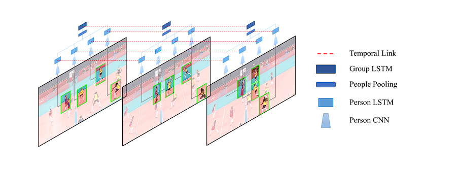
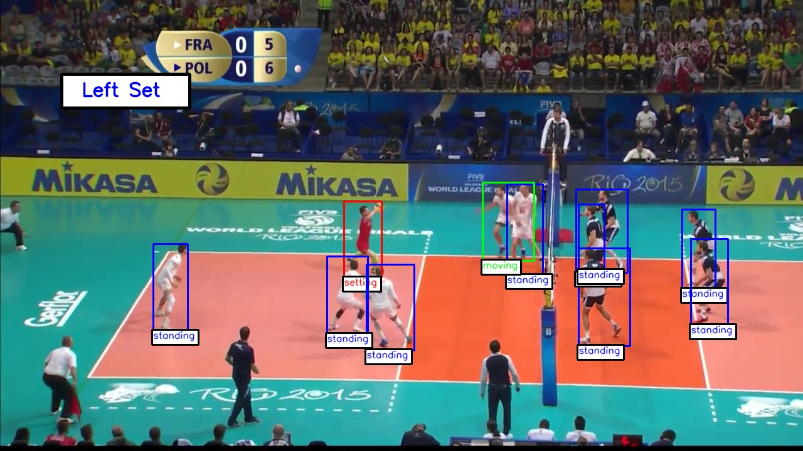
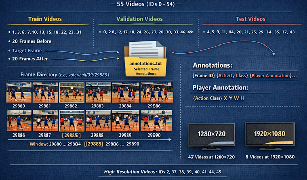

# Hierarchical Deep Temporal Model for Group Activity Recognition
## A PyTorch Implementation of the CVPR 2016 Paper: [*A Hierarchical Deep Temporal Model for Group Activity Recognition*](http://www.cs.sfu.ca/~mori/research/papers/ibrahim-cvpr16.pdf) *Written by Mostafa S. Ibrahim, Srikanth Muralidharan, Zhiwei Deng, Arash Vahdat, and Greg Mori* 

## Table of Contents
- [Abstract](#abstract)
- [Paper Overview](#paper-overview)
- [Dataset](#dataset-overview)
- [Model Architecture](#model-architecture)
- [Experiments](#experiments)
- [Results and Comparison with the Paper](#results-and-comparison-with-the-paper)
- [Key Differences from the Original Paper](#key-differences-from-the-original-paper)
- [Usage and Demo](#usage-and-demo)
- [Project Structure](#project-structure)
- [Installation](#installation)

---
## Abstract
This repository provides a PyTorch reimplementation of the hierarchical deep temporal model introduced at CVPR 2016 for group activity recognition. The model captures temporal dynamics at both the individual and group levels using a two-stage LSTM architecture. The implementation aims to enhances the baseline by replacing AlexNet with the more powerful ResNet50 and modernizes the implementation by moving from Caffe to PyTorch. These updates lead to improved accuracy and result in a more flexible and extensible codebase that supports ongoing research in group activity recognition.

---
## Paper Overview
### Problem

- Group Activity Recognition aims to identify the **collective activity** performed by a group of people in a video scene, rather than recognizing individual actions in isolation.

  This task is challenging because:
  - Group activities depend on **interactions between individuals**
  - **Temporal dynamics** are critical at both individual and group levels

### Key Idea

- The paper proposes a **hierarchical deep temporal model** based on **LSTM networks** that models activity at two levels:
  
  #### Person-level Temporal Modeling
  - Each person is processed independently
  - CNN features are extracted from person bounding boxes
  - An LSTM captures the temporal evolution of each individual’s action
  
  #### Group-level Temporal Modeling
  - Person-level representations are aggregated using pooling
  - The aggregated representation is used to infer the group activity
    

  

**Figure 1:** The key idea of the paper

---
## Dataset Overview

The dataset utilized in this paper is sourced from publicly available YouTube volleyball videos, as referenced in the original paper. It comprises 4,830 annotated frames carefully selected from 55 videos. Each frame is labeled with 9 distinct player action classes and 8 team activity classes.

  

**Figure 2:** Example frame labeled as "Left set" with bounding boxes around each player indicating their respective activities.

  

  

**Figure 3:** Dataset structure and distribution details.

 * The dataset contains 55 videos. Each video has a folder for it with unique IDs (0, 1...54)
 * **Train Videos**: 1 3 6 7 10 13 15 16 18 22 23 31 32 36 38 39 40 41 42 48 50 52 53 54
 * **Validation Videos**: 0 2 8 12 17 19 24 26 27 28 30 33 46 49 51
 * **Test Videos**: 4 5 9 11 14 20 21 25 29 34 35 37 43 44 45 47

* Inside each video directory, a set of directories corresponds to target frame
  * (e.g. volleyball/39/29885) Video 39, target frame ID 29885
* Each target frame directory has 41 images (20 images before target frame, **target frame**, 20 frames after target frame)
  * Scences change quite rapidly in volleyball, hence frames beyond that window shouldn't represent belong to target frame most of time.
  * So used 5 before and 4 after frames.
* Each video directory has annotations.txt file that contains selected frames annotations.
* Each annotation line in format: {Frame ID} {Frame Activity Class} {Player Annotation}  {Player Annotation} ...
* Each {Player Annotation} in format: X Y W H {Action Class}
* Videos with resolution of 1920x1080 are: 2 37 38 39 40 41 44 45 (8 in total). All others are 1280x720.

### Dataset Labels

<table>
  <tr>
    <td valign="top">

#### Group Activity Classes

| Class          | Instances |
|----------------|-----------|
| Right set      | 644       |
| Right spike    | 623       |
| Right pass     | 801       |
| Right winpoint | 295       |
| Left winpoint  | 367       |
| Left pass      | 826       |
| Left spike     | 642       |
| Left set       | 633       |

</td>
    <td valign="top">

#### Action Classes

| Class    | Instances |
|----------|-----------|
| Waiting  | 3601      |
| Setting  | 1332      |
| Digging  | 2333      |
| Falling  | 1241      |
| Spiking  | 1216      |
| Blocking | 2458      |
| Jumping  | 341       |
| Moving   | 5121      |
| Standing | 38696     |

</td>
  </tr>
</table>

---
## Model Architecture
---
## Experiments
---
## Results and Comparison with the Paper
---
## Key Differences from the Original Paper
---
## Usage and Demo
---
## Project Structure
---
## Installation

